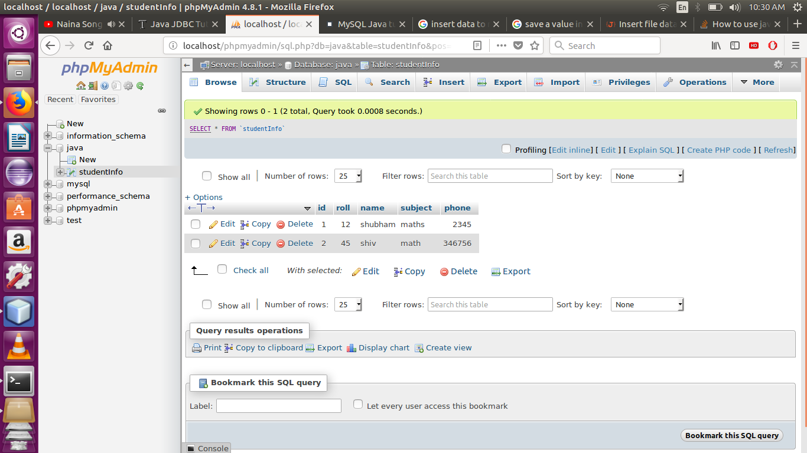
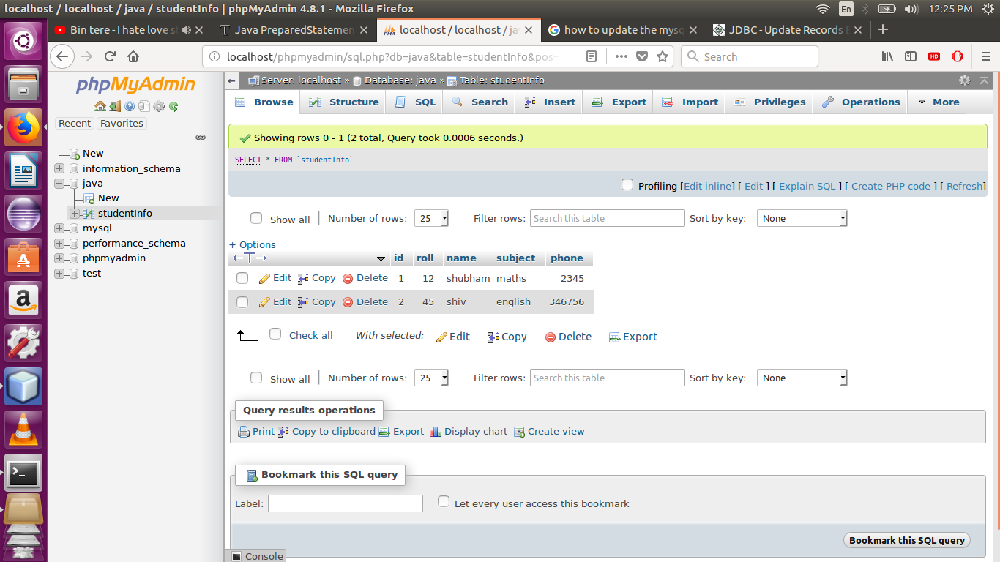

JDBC-MySQL

	Java JDBC is a Java API to connect and execute query with the database. JDBC API uses jdbc
	drivers to connect with the database.
	
	
1)Connecting MySQL with java programm using JDBC and inserting the data into MySQL table 

2)Displaying the data on the console from MySQL database

3)Updating the saved data 

